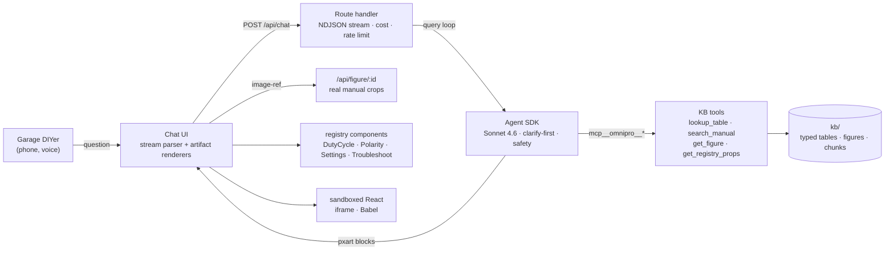
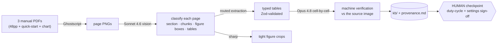

# OmniPro 220 Specialist

A multimodal reasoning agent for the **Vulcan OmniPro 220** multiprocess welder, built on the
**Claude Agent SDK**. It answers deep technical questions the way a good shop-hand would —
grounded in the manual, **cited to the page**, and **drawing the diagram** when words won't do,
for a garage DIYer standing at the machine with a phone.


> **Hosted demo:** **[try it live](https://omnipro--entrasoft-finpredict-2025.us-east4.hosted.app)** — on Firebase App Hosting (Cloud Run), warm and streaming. *(Vanity domain `omnipro.relightlabs.ai` coming soon; it also runs locally in two minutes, below.)*
>
> Built for the [Prox Founding Engineer Challenge](https://useprox.com/join/challenge): manual in,
> product specialist out. The welder is one config — **the same pipeline points at any manual.**

---

## What it does

Ask it anything about the welder. It figures out whether the answer is a number, a procedure, a
diagnosis, or a picture, pulls it from the knowledge base, and answers in the right shape:

| You ask | It does |
|---|---|
| "Duty cycle for MIG at 200 A on 240 V?" | **25 % @ 200 A** *(owner manual p.7)* + an interactive duty-cycle calculator |
| "What polarity for TIG? Which socket for the ground clamp?" | **DCEN, ground clamp → positive** *(p.30)* + a socket-hookup diagram, unprompted |
| "Porosity in my flux-cored welds?" | a page-cited checklist (polarity → CTWD → clean metal…) + a troubleshooting flow |
| "What settings for MIG?" | **one** clarifying question ("what metal, how thick, which wire?"), then the answer |
| "Can I weld aluminum?" | honestly: **not via TIG** on this machine (DC only) — MIG + spool gun only *(p.7)* |
| "Can I weld galvanized?" | the **zinc-fume warning first** *(p.3)*, then technique |
| "Show me the front panel." | the actual manual figure crop, click-to-zoom |

Every answer carries its **receipts**: token usage and a computed per-answer cost (`$0.026 · 2.4s`),
with a session-cost ledger. Voice in/out via the browser (no second vendor key).

---

## Two-minute run

`kb/` is committed, so there's **no extraction step** for reviewers — just plug in a key and go.

```bash
git clone <your-fork> && cd prox-challenge
cp .env.example .env          # add your ANTHROPIC_API_KEY
nvm use                       # Node 22 (or ensure Node >= 20.9)
npm install
npm run dev                   # → http://localhost:3000
```

Other commands: `npm run check` (typecheck + lint) · `npm run eval` (the eval battery) ·
`npm run extract` (rebuilds `kb/` from `files/` — dev-time only; needs Ghostscript).

---

## Architecture

One Next.js app (App Router): the React client and the Agent SDK loop live in the same process.



- **The agent** (`src/agent/`) is defined once and consumed by both the route handler and the eval
  runner — the thing evals grade is the thing users hit.
- **Numbers come from the KB, never the model.** Every duty cycle, polarity, spec, and setting is a
  typed `kb/` lookup returned with its `page` + `source`; the system prompt requires citing them.
- **The agent draws** by emitting typed `<pxart>` blocks inline in its stream; the client parses
  them out and routes each to a renderer (figure crop, registry component, one-shot SVG, or
  sandboxed React). One protocol module is the source of truth for both the agent prompt and the
  parser, so they can't drift.

---

## How knowledge is extracted, represented, and verified

`npm run extract` (`scripts/extract.ts`) is a **product-agnostic pipeline** — the welder is one
entry in a `MANUALS` list; point it at any manual and the same passes run.



**Represented as typed JSON** — one Zod schema (`src/kb/schema.ts`) is the contract for both the
pipeline's output and the runtime tools:

| `kb/` | contents |
|---|---|
| `tables/duty-cycle.json` | rated % @ amps per process × voltage (6 entries) |
| `tables/specs.json` | ratings, current ranges, materials, wire, breaker/circuit |
| `tables/polarity.json` | electrode/ground terminal + DCEP/DCEN per process (8) |
| `tables/synergic-settings.json` | the printed worked examples (the machine is synergic) |
| `tables/troubleshooting.json` | 33 symptom → causes/checks rows |
| `tables/process-selection.json` | the image-only "How to Choose a Welder" chart |
| `figures/index.json` + `img/` | 109 tagged, cropped figures |
| `chunks.jsonl` | 155 page-anchored text chunks for search |
| `provenance.md` | every file → source pages → verification status |

**Verified in three tiers:** Sonnet extraction → **Opus 4.8 re-reads the four critical artifacts
cell-by-cell against the source page image** → a **human checkpoint** signs off the duty-cycle and
settings tables against the PDF. `provenance.md` records the status of each file.

---

## Design decisions

- **KB-not-RAG for numbers.** Duty cycles and polarities are exact facts, not fuzzy retrieval — a
  wrong amperage is worse than "I don't know." So numbers are typed table lookups cited to a page;
  prose (procedures, warnings) uses lexical search over page-anchored chunks. If the KB lacks a
  value, the agent says so instead of inventing one.
- **Hybrid artifact strategy.** Registry components (`DutyCycleCalculator`, `PolarityDiagram`,
  `SettingsConfigurator`, `TroubleshootingFlow`) are the deterministic, instant "money shots" for
  the common questions; agent-authored SVG and sandboxed React are the generative long-tail. The
  agent prefers, in order: the manual's own figure → a component → a one-shot SVG → React.
- **Model routing as a cost lever.** Sonnet 4.6 for the runtime agent + extraction; Haiku 4.5 for
  the cheap eval judge; Opus 4.8 only for extraction verification. Prompt caching is automatic
  (system prompt + tool defs stay byte-stable); a healthy **cache hit rate is a monitored metric** —
  a broken breakpoint would silently ~10× the cost.
- **Every answer carries its receipts.** Usage → computed cost flows SDK → route → client on every
  answer; all rates live in one file (`src/agent/pricing.ts`) and nowhere else.
- **Safety carries through.** Zinc-fume warnings on coated metal, never advise defeating thermal
  protection, internal faults → qualified service — surfaced from the manual, one tight sentence.

---

## Evals

`npm run eval` runs the **real agent** over `evals/questions.json` (28 questions across lookup,
procedure, troubleshoot, ambiguous, visual, safety), grades each with a Haiku judge against
KB-grounded expected answers (semantic match + citation present + clarify-first), checks visual
coverage from emitted `pxart` blocks, and writes a versioned report to `runs/` with cost and cache
metrics and a regression gate.

**Latest baseline** (`runs/2026-07-07T19-39-11`):

| Metric | Value |
|---|---|
| Answer-pass (correct + citation + clarify) | **100 %** (28/28) |
| Full-pass (+ visual) | 96.4 % |
| Visual coverage | 19/20 |
| Mean cost / answer | **$0.031** · p95 $0.058 |
| Cache hit rate | 77.1 % |

Every category passes: lookup 7/7 · procedure 5/5 · troubleshoot 5/5 · ambiguous 4/4 · visual 4/4 ·
safety 3/3. Expected answers are filled **from the KB** and human-verified — the eval is designed to
catch the agent *and* the KB (it caught a real AC-TIG-capability hallucination, and an incomplete
expected answer of my own).

---

## Unit economics

A few cents per answered question on Sonnet with healthy caching — the number that matters for
"cost per deflected support question." A full 28-question eval run is ~**$0.93**. Every request's
usage record appends to `var/usage.jsonl`; the UI shows a per-answer cost chip and a session ledger.

---

## Project layout

```
files/            the 3 manual PDFs (source of truth)
kb/               committed knowledge base + provenance.md
scripts/          extract.ts (pipeline) · eval.ts (battery) · judge-rubric.md
src/
  agent/          agent def, system prompt, tools, pricing, cost, telemetry
  kb/             schema (Zod) + store (typed lookups, search)
  artifacts/      block protocol + stream parser
  components/     registry components + artifact renderers
  app/            chat UI, /api/chat, figure routes, /dev/registry
docs/decisions.md one line per non-obvious choice, per milestone
.claude/skills/   the project's own skills (agent-sdk references, etc.)
```

Built with the Claude Agent SDK (`@anthropic-ai/claude-agent-sdk` 0.3.202), Next.js 16, React 19,
TypeScript, Tailwind v4. Single `ANTHROPIC_API_KEY`.
